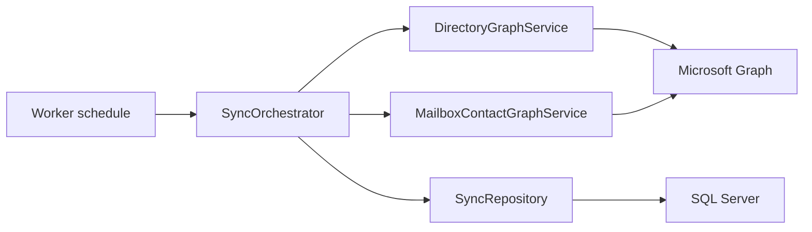

# ContactRelay

ContactRelay is a .NET Windows Worker Service that synchronizes selected Microsoft 365 directory users into managed Contacts folders in target Exchange Online mailboxes by using Microsoft Graph.

The service reads user profile data from Microsoft Entra ID, maps it to Outlook contact fields, and creates or updates contacts in a dedicated mailbox contact folder. It stores sync state in SQL Server so unchanged contacts can be skipped, duplicate managed contacts can be cleaned up, and dry-run plans can be reviewed before writes are enabled.

## Features

- Microsoft Graph application authentication with certificate or client secret.
- Dry-run mode for safe pilots and change reviews.
- Daily cron-style schedule, daily `HH:mm` schedule, or interval fallback.
- Target all user mailboxes only when explicitly enabled, or target a configured Microsoft Entra security group.
- Optional published-contact group filtering.
- Exclusion rules for shared, room, resource, community, disabled, and service-style accounts.
- SQL Server sync state, run history, runtime overrides, and audit records.
- Throttle-aware Microsoft Graph retry handling with exponential backoff and `Retry-After` support.
- Configurable mailbox and user lookup concurrency.
- Windows Service, Windows Event Log, console logging, and optional Sentry logging.
- Optional cleanup of legacy managed contact folders after successful sync.
- Tenant-free unit tests for core behavior.

## Architecture

`Worker` runs the schedule and calls `SyncOrchestrator`. `DirectoryGraphService` reads source users, group members, managers, and mailbox purpose from Microsoft Graph. `MailboxContactGraphService` manages contact folders and contacts in target mailboxes. `SyncRepository` stores state and audit data in SQL Server. `ContactMapper` maps directory fields to Microsoft Graph contact fields and computes hashes for change detection.



## Prerequisites

- Windows Server, Windows client, or Windows VM capable of running a worker service.
- .NET 10 SDK for build, or .NET 10 runtime for framework-dependent deployment.
- SQL Server 2019 or later, Azure SQL, or a compatible SQL Server target.
- Microsoft 365 tenant with Exchange Online mailboxes.
- Microsoft Entra app registration with admin-consented Microsoft Graph application permissions.
- Network access to Microsoft Graph and SQL Server.

## Microsoft Graph Permissions

Use Microsoft Graph application permissions with admin consent.

Required:

- `User.Read.All`: read source users and profile fields.
- `Directory.Read.All`: read directory relationships and group membership.
- `Contacts.ReadWrite`: create, read, update, and delete mailbox contacts.

Recommended when mailbox-type exclusions are enabled:

- `MailboxSettings.Read`: read `mailboxSettings.userPurpose` to distinguish user, shared, room, and equipment mailboxes.

Recommended for least privilege:

- Configure Exchange Online application RBAC, or application access policies where still appropriate, so the app can access only approved mailboxes.
- Pilot with a small target mailbox group before expanding scope.

See [docs/GraphPermissions.md](docs/GraphPermissions.md) for more detail.

## Safe Defaults

The checked-in `appsettings.json`, `appsettings.example.json`, `.env.example`, SQL seed data, docs, and tests must contain placeholders or safe generic values only.

Default safety posture:

- `Sync:DryRun=true`
- `Sync:TargetAllUserMailboxes=false`
- `Sync:DeleteOutOfScopeContacts=false`
- `Sync:DeleteLegacyFolderAfterSuccessfulSync=false`
- `Sync:DeleteLegacyFoldersAfterSuccessfulSync=false`
- `Sync:LogSensitiveIdentifiers=false`

Do not enable writes, broad mailbox targeting, out-of-scope deletion, or legacy folder deletion until a dry-run plan has been reviewed and approved.

## Configuration

Copy `ContactRelay/appsettings.example.json` to a deployment-specific `appsettings.json`, or use the checked-in `ContactRelay/appsettings.json` as a safe placeholder template. Do not commit environment-specific values.

All settings can be overridden with environment variables using double underscores, such as `Graph__TenantId`, `Graph__ClientId`, and `Sql__ConnectionString`.

Required secrets and tenant values should come from environment variables, .NET user secrets for local development, Azure Key Vault, a managed deployment secret store, or another secure provider.

### Service Settings

| Option | Description |
| --- | --- |
| `Service:Name` | Windows Service name and Event Log source. |

### Sync Settings

| Option | Description |
| --- | --- |
| `Enabled` | Set `false` to disable sync runs. |
| `DryRun` | When `true`, Graph writes are skipped and planned actions are written to SQL. |
| `RunOnStartup` | Runs one sync immediately when the service starts. |
| `Schedule` | Six-field daily cron expression such as `0 0 20 * * *`. |
| `DailyRunTime` | Daily local time fallback such as `20:00`. |
| `IntervalMinutes` | Fallback interval when daily schedules are unset or invalid. |
| `TargetAllUserMailboxes` | Targets all enabled Exchange Online user mailboxes when `true`; keep `false` until broad mailbox scope is approved. |
| `ManagedFolderName` | Dedicated contact folder created in target mailboxes. |
| `LegacyContactFolderName` | Optional old folder name to remove after successful sync. |
| `LegacyManagedFolderNames` | Additional old folder names to remove after successful sync. |
| `ManagedCategory` | Outlook category used to identify managed contacts. |
| `ManagedByMarker` | Metadata marker written to managed contact notes. |
| `CompanyName` | Optional company value written to managed contacts. |
| `DeleteOutOfScopeContacts` | Deletes managed contacts whose source users are no longer in scope; default is `false` for safe rollout. |
| `DeleteLegacyFolderAfterSuccessfulSync` | Removes configured legacy folders only after successful mailbox sync; default is `false` for safe rollout. |
| `DeleteLegacyFoldersAfterSuccessfulSync` | Compatibility flag for legacy-folder cleanup; default is `false` for safe rollout. |
| `ExcludeCommunityMailboxes` | Excludes community mailboxes when detected. |
| `ExcludeSharedMailboxes` | Excludes shared mailboxes when detected. |
| `ExcludeServiceAccounts` | Excludes accounts matching configured name patterns. |
| `ExcludeDisabledAccounts` | Excludes disabled Microsoft Entra users. |
| `ExcludeRoomAndResourceMailboxes` | Excludes room, equipment, and resource mailboxes. |
| `ExcludedAccountNamePatterns` | Case-insensitive account-name patterns for service-style accounts. |
| `MailboxConcurrency` | Maximum target mailboxes processed in parallel. Valid range: 1 to 64. |
| `StaleRunTimeoutHours` | Marks old `Running` SQL run records failed after this many hours. |
| `LogSensitiveIdentifiers` | When `false`, mailbox and object identifiers are redacted in application logs. |

### Graph Settings

| Option | Description |
| --- | --- |
| `TenantId` | Microsoft Entra tenant ID. Supply securely. |
| `ClientId` | App registration client ID. Supply securely. |
| `ClientSecret` | App client secret. Prefer certificates for production. |
| `CertificateThumbprint` | Certificate thumbprint for certificate auth. |
| `CertificateStoreLocation` | `LocalMachine` or `CurrentUser`. |
| `TargetMailboxSecurityGroupId` | Optional Entra group ID for mailbox targeting. |
| `PublishedContactSecurityGroupId` | Optional Entra group ID for source contacts. |
| `PageSize` | Microsoft Graph page size, from 1 to 999. |
| `BatchSize` | Microsoft Graph batch size, from 1 to 20. |
| `MaxRetryAttempts` | Retry attempts for retryable Graph failures. |
| `BaseRetryDelaySeconds` | Base delay for exponential backoff. |
| `UserLookupConcurrency` | Parallelism for individual user lookups. Valid range: 1 to 64. |
| `Scopes` | Graph scopes. For client credentials, use `https://graph.microsoft.com/.default`. |

### SQL Settings

| Option | Description |
| --- | --- |
| `ConnectionString` | SQL Server connection string. Supply securely. |
| `CommandTimeoutSeconds` | SQL command timeout. |

### Sentry Settings

| Option | Description |
| --- | --- |
| `Dsn` | Optional Sentry DSN. Leave empty to disable. |
| `Environment` | Optional environment tag. |
| `Release` | Optional release tag. |
| `Debug` | Enables Sentry SDK debug output. |
| `TracesSampleRate` | Optional trace sample rate. |


## Example appsettings.json

This example contains safe placeholder values only. Supply `Graph:TenantId`, `Graph:ClientId`, one Graph credential, and `Sql:ConnectionString` through a secure configuration source before starting the service.

```json
{
  "Service": {
    "Name": "ContactRelay"
  },
  "Sync": {
    "Enabled": true,
    "DryRun": true,
    "RunOnStartup": false,
    "Schedule": "0 0 20 * * *",
    "DailyRunTime": "20:00",
    "IntervalMinutes": 360,
    "TargetAllUserMailboxes": false,
    "ManagedFolderName": "ContactRelay",
    "LegacyContactFolderName": "",
    "ManagedCategory": "ContactRelay Managed",
    "ManagedByMarker": "ManagedBy=ContactRelay",
    "CompanyName": "",
    "DeleteOutOfScopeContacts": false,
    "DeleteLegacyFolderAfterSuccessfulSync": false,
    "DeleteLegacyFoldersAfterSuccessfulSync": false,
    "MailboxConcurrency": 8,
    "StaleRunTimeoutHours": 6,
    "LogSensitiveIdentifiers": false
  },
  "Graph": {
    "TenantId": "",
    "ClientId": "",
    "ClientSecret": "",
    "CertificateThumbprint": "",
    "CertificateStoreLocation": "LocalMachine",
    "PageSize": 999,
    "BatchSize": 20,
    "MaxRetryAttempts": 8,
    "BaseRetryDelaySeconds": 2,
    "UserLookupConcurrency": 10,
    "Scopes": [
      "https://graph.microsoft.com/.default"
    ]
  },
  "Sql": {
    "ConnectionString": "",
    "CommandTimeoutSeconds": 120
  }
}
```

## Secret Management

Never commit real secrets or organization-specific values.

Use one of:

- Environment variables.
- .NET user secrets for local development.
- Azure Key Vault or another managed secret store.
- A deployment platform secret provider.

Use `.env.example` only as a checklist for environment variable names. Do not put real values in `.env.example`, and do not commit local `.env` files.

## Build

```powershell
dotnet restore .\ContactRelay.slnx
dotnet build .\ContactRelay.slnx -c Release
```

## Database Setup

The SQL scripts use a SQLCMD variable named `DatabaseName`.

```powershell
sqlcmd -S SQL_SERVER_NAME -E -v DatabaseName="CONTACT_RELAY_DATABASE" -i .\sql\001 CreateSchema.sql
```

Use an authentication method approved by your organization. Avoid putting SQL passwords in shell history or committed scripts.

## Run Locally

Use .NET user secrets or environment variables for required values.

```powershell
dotnet user-secrets set "Graph:TenantId" "TENANT_ID" --project .\ContactRelay\ContactRelay.csproj
dotnet user-secrets set "Graph:ClientId" "CLIENT_ID" --project .\ContactRelay\ContactRelay.csproj
dotnet user-secrets set "Graph:ClientSecret" "CLIENT_SECRET" --project .\ContactRelay\ContactRelay.csproj
dotnet user-secrets set "Sql:ConnectionString" "SQL_CONNECTION_STRING" --project .\ContactRelay\ContactRelay.csproj
dotnet run --project .\ContactRelay\ContactRelay.csproj
```

Keep `Sync:DryRun` set to `true` until the SQL plan and mailbox scope are verified. Keep broad targeting and destructive cleanup settings disabled until they are approved for the tenant.


## Run as a Console App

The worker can be run directly during local development or dry-run validation:

```powershell
dotnet run --project .\ContactRelay\ContactRelay.csproj
```

When not installed as a Windows Service, logs are written to the console and any configured providers. Required Graph and SQL values must still be supplied through user secrets, environment variables, or another secure provider.

## Install as a Windows Service

Publish the service:

```powershell
dotnet publish .\ContactRelay\ContactRelay.csproj -c Release -r win-x64 --self-contained false -o C:\Services\ContactRelay
```

Run PowerShell as Administrator:

```powershell
$serviceName = "ContactRelay"
$servicePath = "C:\Services\ContactRelay\ContactRelay.exe"

New-Service `
  -Name $serviceName `
  -BinaryPathName "`"$servicePath`"" `
  -DisplayName $serviceName `
  -Description "Synchronizes directory contacts into Microsoft 365 mailbox contact folders." `
  -StartupType Automatic

Start-Service -Name $serviceName
```

Configure restart recovery:

```powershell
sc.exe failure "ContactRelay" reset= 86400 actions= restart/60000/restart/60000/restart/300000
```

## Uninstall the Windows Service

Run PowerShell as Administrator:

```powershell
$serviceName = "ContactRelay"
Stop-Service -Name $serviceName -ErrorAction SilentlyContinue
sc.exe delete $serviceName
```

## Configure the Sync Interval

For one run per day, set `Sync:Schedule` to a six-field daily cron expression. For example, `0 30 2 * * *` runs at 02:30 local server time. You can also clear `Schedule` and set `DailyRunTime` to a value such as `02:30`. If both daily settings are unset or invalid, `IntervalMinutes` is used.

The worker uses an in-process lock so a new scheduled run is skipped when a previous run is still active.

## Dry-run Mode

Dry-run mode skips Graph writes and records planned creates, updates, deletes, skips, and failures in SQL run tables.

Recommended pilot flow:

1. Set `Sync:DryRun` to `true`.
2. Keep `Sync:TargetAllUserMailboxes=false`.
3. Scope target mailboxes to a small test group or SQL target list.
4. Start the service.
5. Review `dbo.SyncRun` for the run summary.
6. Review `dbo.SyncRunItem` for planned creates, updates, deletes, skips, and failures.
7. Confirm target mailbox scope and source contact scope.
8. Set `Sync:DryRun` to `false` only after the plan is approved.

- SQL failures occur: verify connection string, database schema, service identity rights, and command timeout.

## Testing

Unit tests do not require Microsoft 365, Microsoft Graph, Exchange Online, or SQL Server.

```powershell
dotnet test .\ContactRelay.slnx -c Release
dotnet format .\ContactRelay.slnx --verify-no-changes --no-restore
dotnet list .\ContactRelay\ContactRelay.csproj package --vulnerable --include-transitive
```

The test suite covers:

- Configuration validation.
- Contact mapping and comparison.
- Missing required fields.
- Disabled or invalid directory users.
- Retry and throttling behavior.
- Dry-run planning.
- No-change contact skip behavior.
- Existing contact update detection.
- Duplicate prevention.
- Mailbox-level error isolation.

## Integration Testing

Real Microsoft 365 integration tests are intentionally disabled by default and are not part of normal CI. Use a non-production tenant, dedicated test mailboxes, scoped Graph permissions, and explicit environment variables only. See [docs/IntegrationTesting.md](docs/IntegrationTesting.md).

## CI/CD

GitHub Actions workflows are included for:

- Restore, build, test, formatting verification, dependency vulnerability checks, and deprecated-package checks.
- CodeQL analysis for C#.
- Dependabot update checks for NuGet and GitHub Actions.

Enable GitHub secret scanning and push protection before public release. Treat CI logs and artifacts as potentially sensitive and avoid printing environment-specific values.

## Security Considerations

- `Contacts.ReadWrite` application permission can write contacts across allowed mailboxes. Scope mailbox access wherever possible.
- SQL tables contain mailbox addresses, source object IDs, contact IDs, and operational audit data.
- Do not enable `LogSensitiveIdentifiers` unless your log destination is approved for mailbox identifiers and object IDs.
- Do not commit real appsettings files, certificates, logs, exports, screenshots, or database backups.
- Enable GitHub secret scanning, Dependabot alerts, CodeQL, and branch protection before public release.
- Review privacy, retention, eDiscovery, and user-notification requirements before deploying.

## Credential Rotation and Git History Audit

If a real secret, tenant ID, client ID, certificate thumbprint, connection string, mailbox address, domain, URL, or organization-specific value may have been staged, committed, pushed, copied into a build artifact, or shared in a log:

1. Rotate or revoke the exposed credential immediately.
2. Audit all branches, tags, pull requests, forks, releases, packages, CI logs, and artifacts.
3. Verify the current working tree and staged index contain placeholders only.
4. Rewrite Git history before public release if sensitive values were committed.
5. Re-run secret scanning after cleanup.

See [docs/GitHistoryAudit.md](docs/GitHistoryAudit.md) for `git filter-repo` and BFG Repo-Cleaner guidance.

## Deployment Recommendations

- Use certificate authentication instead of client secrets for production.
- Store secrets outside source control.
- Run the service under a dedicated least-privilege Windows identity.
- Restrict Microsoft Graph mailbox access with Exchange Online application RBAC or approved mailbox scoping controls.
- Start every deployment in dry-run mode.
- Pilot with a small target mailbox group before broad rollout.
- Back up the SQL database before enabling deletes or legacy folder cleanup.
- Monitor failed `SyncRunItem` rows and Windows Event Log entries.
- Rotate credentials and certificates on a documented schedule.

## Production Deployment Checklist

- Graph app registration created and admin consent granted.
- Mailbox access scope configured and tested.
- SQL schema deployed and backed up.
- Secrets supplied through a secure provider.
- `Sync:DryRun=true` tested and reviewed.
- Target mailbox scope verified.
- Legacy folder cleanup disabled until migration behavior is confirmed.
- Logging destination approved for operational data.
- Windows Service recovery configured.
- Build and deployment artifacts generated from a clean working tree.
- License and contribution policy reviewed before public release.

## Public Release Checklist

- `SECURITY.md`, `CONTRIBUTING.md`, `CODE_OF_CONDUCT.md`, issue templates, pull request template, Dependabot, CI, and CodeQL are present.
- Git history has been audited for secrets and organization-specific values.
- Any exposed credentials have been rotated or revoked.
- GitHub secret scanning and push protection are enabled.
- All examples use placeholders only.
- Tests, build, formatting, dependency vulnerability checks, and CodeQL pass.
- Integration testing has been completed in a non-production tenant.

## Repository Hygiene

The `.gitignore` excludes common local settings, secrets, certificates, logs, build output, publish output, test results, coverage reports, temporary files, and IDE-specific files.

Do not commit:

- Real `appsettings.*.json` files, except `appsettings.example.json`.
- `.env` files, except `.env.example`.
- Certificates or private keys.
- Logs, traces, dumps, screenshots, exports, SQL backups, or publish output.
- Tenant-specific names, IDs, URLs, domains, or mailbox addresses.

## Documentation

- [docs/Deployment.md](docs/Deployment.md): publish and install as a Windows Service.
- [docs/GraphPermissions.md](docs/GraphPermissions.md): Graph permissions and app registration notes.
- [docs/GitHistoryAudit.md](docs/GitHistoryAudit.md): Git history audit and secret remediation.
- [docs/IntegrationTesting.md](docs/IntegrationTesting.md): safe non-production integration test plan.
- [SECURITY.md](SECURITY.md): vulnerability reporting and secret handling policy.
- [CONTRIBUTING.md](CONTRIBUTING.md): contribution rules and validation checklist.
- [CODE_OF_CONDUCT.md](CODE_OF_CONDUCT.md): community conduct expectations.

## Contributing

Contributions are welcome. Open an issue for bugs or design changes before large pull requests. Keep examples generic, avoid tenant-specific data, and do not include real credentials, tenant IDs, mailbox addresses, logs, screenshots, or exported directory data.

## License

This repository includes a GPL-3.0 license file. Review the license with the project owner before publishing.

## Disclaimer

You are responsible for configuring permissions, mailbox scope, retention, privacy controls, and operational safeguards in compliance with your policies and applicable laws.